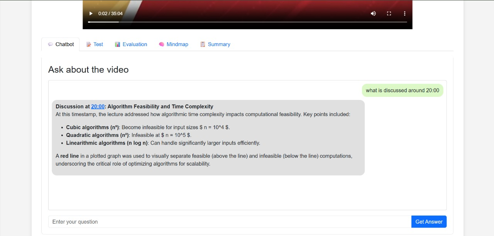

# LectureAI - your personal AI tutor

## Abstract
Developed Agentic-AI framework called "Lecture-AI" that addresses the key drawbacks of traditional video-based learning, such as linear information flow, limited interaction, etc. App converts lecture videos into interactive learning experiences, providing a personalized chatbot, mind map, notes, and other materials for enhanced engagement and effectiveness. This Agentic-AI tool enhances learning experiences and saves learners 30–50% of their time through personalized, automated academic support.

# 🎓 LectureAI – Your Personal AI Tutor

**Summer 2025 Internship Project** 
**Topic:** AI Agents for Automation of Tasks 
**Lab:** Algo Lab 
**Team:** Ayushman Anupam, Tejaswi Sherawat 
**Mentors:** Animesh Guchhait, Chandrashish Prasad, Hithesh KK, Rahul Shah

## 📖 Overview

### Problem Statement

The rapid growth of educational videos in the last decade has led to challenges such as:

* **Linear Information Flow** – Hard to jump to exactly what you need.
* **Information Overload** – Too much content without smart filtering.
* **Time-Consuming Search** – Manual scrolling to find relevant sections.
* **Limited Interaction** – No real-time Q\&A or contextual summaries.
* **Workflow Breaks** – Needing to leave the platform for missing info.
* **No Personalized Feedback** – No way to measure understanding or progress.
  
### 🎥 Demo Video

### Our Solution
**LectureAI** takes video lecture and transforms it pssive watching into an **interactive, insightful, and personalized learning experience** using an **agentic AI framework**.
With specialized AI agents, it allows users to:

* Ask contextual questions directly about the video.
* Get timestamp-based explanations.
* Generate quizzes (MCQs) with detailed evaluation.
* Create mind maps and structured notes.
* Explore beyond-video knowledge using web search.

## 🚀 Summary of the App & Feature Highlights

* **🎯 AI-Powered Chatbot** – Uses **Retrieval-Augmented Generation (RAG)**, timestamp finders, and explainers to answer queries with context.
* **📝 MCQ Generation & Evaluation** – Auto-creates quizzes with scoring, explanations, and difficulty breakdown.
* **🧠 Mind Map Creation** – Converts video transcripts into a **Graphviz-powered** visual map of topics.
* **📚 Notes Generation** – Creates structured notes with an introduction, key takeaways, and conclusion.
* **🔍 Multi-Agent Architecture** – Central LLM-based controller picks the right agent for each task, with a validation layer for accuracy.
* **⚡ Resource Creation Pipeline** – Automatically extracts raw transcripts, semantic chunks, and time-bounded chunks to power all features.

## 🛠 Technologies Used

* **Programming Language:** Python
* **AI & NLP:**
  * RAG, faiss(for database), ffmpeg (for videos)
  * LLM APIs (OpenAI, Hugging Face)
  * Embedding Model: `mixedbread-ai/mxbai-embed-large-v1`
  * Whisper for transcription
* **Frameworks & Libraries:**
  * Langraph for LectureAI (Agentic AI framework)
  * LangChain for MCQ workflows
  * Graphviz for mind map rendering
  * ffmpeg for audio extraction
* **Search & Retrieval:** Vector Store (FAISS)
* **APIs & Tools:** Tavily Search API, RAG pipelines

---

## 🤝 Let’s Connect!

😊 I’m always open to meaningful conversations, collaborative projects, and idea exchanges in the fields of **graph theory**, **machine learning**, and **data science**.
If you’re interested in discussing new insights, working together on related topics, or contributing to ongoing discussions — feel free to reach out!
**Let’s learn and build together 🚀**

